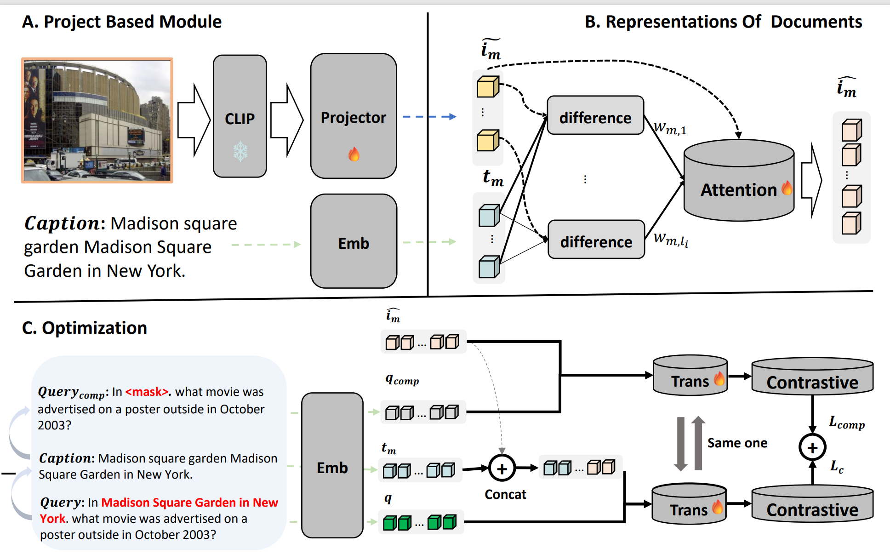

#  Enhancing Multimodal Retrieval via Complementary Information Extraction and Alignment

## Overview
<p align="center">
  
</p>

## Requirement
**1. Install the following packages using Pip or Conda under this environment**

```
Python==3.7
Pytorch
transformers
clip
faiss-cpu==1.7.0
tqdm
numpy
base64
Install the pytrec_eval from https://github.com/cvangysel/pytrec_eval
```
We provide the version file `requirements.txt` of all our used packages, if you have any problems configuring the environment, please refer to this document.

**2. Prepare the pretrained CLIP and T5-ANCE**

CIEA is built on [CLIP](https://huggingface.co/openai/clip-vit-base-patch32) and [T5-ANCE](https://huggingface.co/OpenMatch/t5-ance) model.

## Reproduce CIEA
### Download Code & Dataset
* First, use `git clone` to download this project:
```bash
git clone https://github.com/sysu18364004/CIEA
cd CIEA
```
* Download link for our WebQA: [WebQA](https://thunlp.oss-cn-qingdao.aliyuncs.com/UniVLDR/data.zip). (❗️Note: For the ```imgs.tsv```, you need to download the data from [this link](https://drive.google.com/drive/folders/1ApfD-RzvJ79b-sLeBx1OaiPNUYauZdAZ?usp=sharing) and run ```7z x imgs.7z.001```).

* Download EDIS by the link: [EDIS](https://github.com/emerisly/EDIS/tree/master) and change the format. 
```
data/
├──WebQA/
│   ├── train.json
│   ├── dev.json
│   ├── test.json
│   ├── test_qrels.txt
│   ├── all_docs.json
│   ├── all_imgs.json
│   ├── imgs.tsv
│   └── imgs.lineidx.new
├──EDIS/
├── train.json
│   ├── dev.json
│   ├── test.json
│   ├── test_qrels.txt
│   ├── all_imgs.json
│   ├── imgs.tsv
│   └── imgs.lineidx.new

```
### Train CIEA-ANCE
**Using the WebQA dataset as an example, I will show you how to reproduce the results in the CIEA paper. The same is true for the EDIS dataset.  You can skip a step and continue training.**

* You can simplily go to the ``DPR`` folder and conduct the ``bash pipeline &gpuid &lambda`` to start or step by step as follow:

* First step: build the ``pretrain`` folder and download pretrain CIEA's visual module [checkpoint](https://huggingface.co/OpenMatch/marvel-pretrain) provided by MARVEL:

* Second step: Go to the ``DPR`` folder and train CIEA-DPR using inbatch negatives:
```
cd DPR
bash train_webqa.sh
```
* Third step: Then using CIEA-DPR to generate hard negatives for training CIEA-ANCE: 
```
bash get_hn_webqa.sh
```
* Final step: Go to the ``ANCE`` folder and train CIEA-ANCE using hard negatives :
```
cd ANCE
bash train_ance_webqa.sh
```

## Evaluate Retrieval Effectiveness
* These experimental results are shown in Table 2 of our paper.
* Go to the ``DPR`` or ``ANCE`` folder and evaluate model performance as follow:
```
bash gen_embeds.sh
bash retrieval.sh
```


